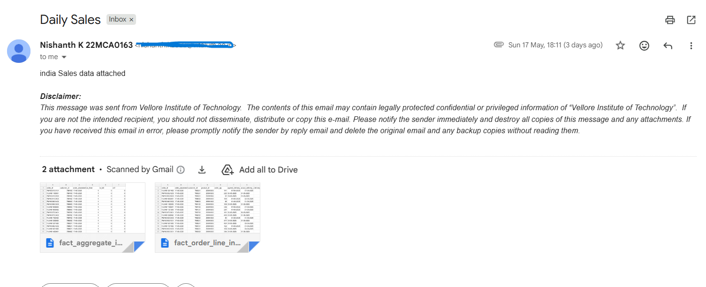
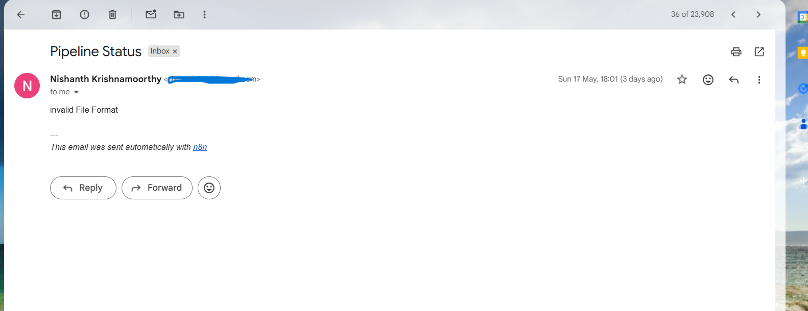

# Automated Supply Chain Analytics Pipeline

## Overview

This project automates the ingestion and analysis of supply chain transaction data received through email attachments.

Using n8n, CSV files are automatically extracted from Gmail and stored in Supabase PostgreSQL. The data is then cleaned and transformed using Pandas, and key supply chain KPIs are visualized in a Streamlit dashboard.

The project was built to reduce manual processing effort and create a centralized reporting workflow for supply chain performance monitoring.

---

# Problem Statement

AtliQ Mart receives daily transactional CSV files from different regions through email attachments. Manually processing these files was time-consuming and created challenges in tracking fulfillment performance consistently.

The objective of this project was to automate the end-to-end data pipeline for:

- Email-based CSV ingestion
- Data validation
- Centralized cloud storage
- Data cleaning and transformation
- KPI reporting dashboard

---

# Tech Stack

| Tool | Purpose |
|---|---|
| n8n | Workflow automation |
| Supabase PostgreSQL | Cloud database |
| PostgreSQL | Data storage |
| Pandas | Data cleaning & transformation |
| Streamlit | Dashboard creation |

---

# Workflow Architecture

```text
Gmail → n8n → Supabase PostgreSQL → Pandas → Streamlit Dashboard
```

---

# Features Implemented

- Automated extraction of CSV attachments from Gmail
- Validation for attachment availability
- CSV file format validation
- Automated loading into Supabase PostgreSQL
- Data cleaning and transformation using Pandas
- Duplicate record handling in Pandas
- Automated success and failure email notifications
- Interactive Streamlit dashboard for KPI analysis

---

# n8n Workflow

The workflow performs the following validations and processes:

1. Trigger workflow from Gmail
2. Check whether attachments are available
3. Validate whether uploaded files are CSV files
4. Extract CSV data
5. Load data into Supabase PostgreSQL
6. Send success/failure notification emails

## n8n Workflow Screenshot

```md

```

---

# Notification System

The workflow sends automated notifications for both successful and failed executions.

## Success Email Sample

```md

```

## Failure Email Sample

```md

```

---

# Data Processing

The project processes supply chain transactional data including:

- Order Quantity
- Delivery Quantity
- Agreed Delivery Date
- Actual Delivery Date
- On Time Delivery
- In Full Delivery
- OTIF metrics

Date columns were cleaned and transformed using Pandas before analysis.

---

# Duplicate Handling

Duplicate transaction rows were identified and removed during the Pandas transformation process using:

```text
(order_id, product_id)
```

as the business key combination.

---

# Dashboard KPIs

The Streamlit dashboard tracks:

- Line Fill Rate
- Volume Fill Rate
- OTIF %
- On Time Delivery %
- In Full Delivery %

to analyze supply chain fulfillment performance.

## Streamlit Dashboard Screenshot

```md

```

---

# Key Learnings

Through this project, I learned:

- ETL workflow automation using n8n
- PostgreSQL integration with Supabase
- Data cleaning and transformation using Pandas
- Handling transactional supply chain datasets
- Building interactive dashboards using Streamlit
- Workflow validation and notification handling

---

# Future Improvements

- Database-level duplicate prevention
- Incremental data loading
- Advanced error logging
- Cloud deployment for Streamlit dashboard

---

# Conclusion

This project helped me understand how to build an end-to-end automated data pipeline by integrating workflow automation, cloud databases, Python-based data transformation, and dashboard development into a single supply chain analytics solution.
